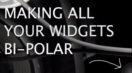

## Inverter

A widget for [Übersicht](http://tracesof.net/uebersicht/) that can be used to allow toggling between light and dark (or any two style) modes. It provides an "inverted" class that you can use in widget styling to provide a secondary appearance. Handy if you want to use Übersicht in multiple spaces with different brightness desktop images.

Here's a [YouTube video of Inverter in action](https://www.youtube.com/watch?v=EcD_3wirU6A&feature=youtu.be), in case you're trying to figure out if you'd actually care about this or not.

### How to use it

Hold down your "interaction" modifier key (set in application Preferences) and hover over the semicircle in the corner of your screen. The bubble will expand to a page corner, and clicking it will apply the "inverted" class to the body tag of the invisible Ubersicht browser window. To get click/hover interaction started, you sometimes need to click the desktop while holding the modifier key.

### What it does

It simply applies the class "inverted" to the body tag of the entire Ubersicht window, which you can then use to add alternate styling to your widgets.

### Making it work with widgets

To style widgets to make use of this, just add a section with `body.inverted` as the parent of the elements you want to change, making sure to increase specificity as needed to override the default when the class is applied.

In Stylus, a simple:

    body.inverted &
      -webkit-filter invert(100%)

will usually do the trick, but you'll often want to compensate more manually for hue shifts and contrast issues (which can also be handled with -webkit-filter, but they can get RAM expensive).

### Additional configuration

You can position the click target in any corner of the window by changing the classes on the `<b>` element in the render method. The options are "top," "botom," "left," and "right" in any combination. The default is the bottom right corner of the screen:

    <b class="right bottom" id="inverter">#{output}</b>

_Don't change the ID!_

### Notes

There's a commented line in the "on.click()" section of the afterRender method containing a "@run()" command. An AppleScript is also included in the widget folder (It's for toggling between two versions of my [Sidecar jacket](http://brettterpstra.com/projects/sidecar/) for [Simplify](http://mmth.us/simplify/)). This is just to demo what you can do with the click handler and a shell script, but it's nothing new.

This thing needs some work, I know. It also needs a way to trigger automatically, but I think that would require having an API to access Übersicht from AppleScript, Lua, JavaScript for Automation or anything, and I don't think we have that. Do we? ...

Here's [an 11MB animated gif "demo"](http://assets.brettterpstra.com.s3.amazonaws.com/inverter.gif) because that's how I roll. Actually, I made a mistake when sizing it but didn't feel like starting over. It's your bandwidth, man.
