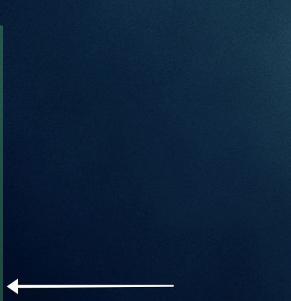

## Average load bar for Übersicht

A widget for [Übersicht](http://tracesof.net/uebersicht/) that displays a thin bar on the left side of the screen indicating the 5-minute average CPU load. Under normal CPU load it's almost invisible, but changes color and opacity as the load gets higher. Color and height changes are animated.

It formats its height based on the screen size, so it should work on any size monitor, stretching the full height of the screen at max load.



### Adjusting values

Based on how many cores you have and what your average load is, you may want to adjust the definitions for the alert levels. In the `update` function, change the values for each level (in descending order):

```coffee
colorclass = switch
  when val > 4 then 'urgent'
  when val > 3 then 'important'
  when val > 2 then 'high'
  when val > 1 then 'normal'
  else 'low'
```

### Adjusting colors

The colors for each level can be adjusted in the `style` section:

```
.low::-webkit-progress-value
  background-color: rgba(134, 229, 255, .05)

.normal::-webkit-progress-value
  background-color: rgba(134, 255, 153, .25)

.high::-webkit-progress-value
  background-color: rgba(243, 255, 134, .65)

.important::-webkit-progress-value
  background-color: rgba(185, 134, 255, .75)

.urgent::-webkit-progress-value
  background-color: rgba(255, 71, 71, 1)
```

### Notes

Adjust the refresh rate as desired.
