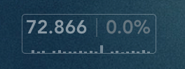

## Pingo: average server ping times and chart

A widget for [Übersicht](http://tracesof.net/uebersicht/) that Displays 10-ping average, packet loss, and chart of results over time. Packet loss turns red when over a defined threshold.

### Notes

* Change the server as desired, defaults to google.com.
* Defaults to 10 pings every 5 minutes. Adjust the refresh rate and `-c` value in the command to alter.
